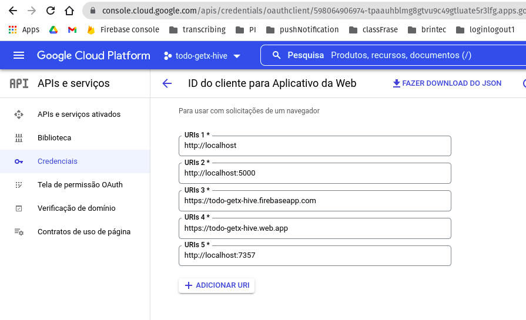

# Versao Web
## etapa 1
Seguir os passos do console do firebase nao instalando npm no index. usando script.
Depois localmente foi.
```
catalunha@pop-os:~/myapp/todo_getx_hive$ firebase login
i  Firebase optionally collects CLI usage and error reporting information to help improve our products. Data is collected in accordance with Google's privacy policy (https://policies.google.com/privacy) and is not used to identify you.

? Allow Firebase to collect CLI usage and error reporting information? Yes
i  To change your data collection preference at any time, run `firebase logout` and log in again.

Visit this URL on this device to log in:
https://accounts.google.com/o/oauth2/auth?client_id=563584335869-fgrhgmd47bqnekij5i8b5pr03ho849e6.apps.googleusercontent.com&scope=email%20openid%20https%3A%2F%2Fwww.googleapis.com%2Fauth%2Fcloudplatformprojects.readonly%20https%3A%2F%2Fwww.googleapis.com%2Fauth%2Ffirebase%20https%3A%2F%2Fwww.googleapis.com%2Fauth%2Fcloud-platform&response_type=code&state=594865939&redirect_uri=http%3A%2F%2Flocalhost%3A9005

Waiting for authentication...

✔  Success! Logged in as brintec.education@gmail.com
catalunha@pop-os:~/myapp/todo_getx_hive$ firebase init

     ######## #### ########  ######## ########     ###     ######  ########
     ##        ##  ##     ## ##       ##     ##  ##   ##  ##       ##
     ######    ##  ########  ######   ########  #########  ######  ######
     ##        ##  ##    ##  ##       ##     ## ##     ##       ## ##
     ##       #### ##     ## ######## ########  ##     ##  ######  ########

You're about to initialize a Firebase project in this directory:

  /home/catalunha/myapp/todo_getx_hive

? Which Firebase features do you want to set up for this directory? Press Spa
ce to select features, then Enter to confirm your choices. Hosting: Configure
 files for Firebase Hosting and (optionally) set up GitHub Action deploys

=== Project Setup

First, let's associate this project directory with a Firebase project.
You can create multiple project aliases by running firebase use --add, 
but for now we'll just set up a default project.

? Please select an option: Use an existing project
? Select a default Firebase project for this directory: todo-getx-hive (todo-
getx-hive)
i  Using project todo-getx-hive (todo-getx-hive)

=== Hosting Setup

Your public directory is the folder (relative to your project directory) that
will contain Hosting assets to be uploaded with firebase deploy. If you
have a build process for your assets, use your build's output directory.

? What do you want to use as your public directory? build/web
? Configure as a single-page app (rewrite all urls to /index.html)? No
? Set up automatic builds and deploys with GitHub? No
✔  Wrote build/web/404.html
✔  Wrote build/web/index.html

i  Writing configuration info to firebase.json...
i  Writing project information to .firebaserc...

✔  Firebase initialization complete!
catalunha@pop-os:~/myapp/todo_getx_hive$ 
```

## etapa 2
https://developers.google.com/identity/sign-in/web/sign-in



```
  <script src="https://apis.google.com/js/platform.js" async defer></script>
  <meta name="google-signin-client_id" content="598064906974-tpaauhblmg8gtvu9c49gtluate5r3lfg.apps.googleusercontent.com">

</head>
```


# minSdkVersion
Abra o arquivo: android/local.properties

Acrescente esta variável
```
flutter.minSdkVersion=21
```

Abra o arquivo: android/app/build.gradle
Acrescente esta variável. Após o indicado.
```
apply plugin: 'com.android.application'
...
def flutterMinSdkVersion = localProperties.getProperty('flutter.minSdkVersion')
if (flutterMinSdkVersion == null) {
    flutterMinSdkVersion = flutter.minSdkVersion.toString()
}
...

    defaultConfig {
        ...
        // minSdkVersion flutter.minSdkVersion
        minSdkVersion flutterMinSdkVersion.toInteger()
        ...
    }
```


# SHA1
catalunha@pop-os:~/myapp/todo_getx_hive$ keytool -list -v -alias androiddebugkey -keystore ~/.android/debug.keystore
Enter keystore password:  
Alias name: androiddebugkey
Creation date: Feb 27, 2022
Entry type: PrivateKeyEntry
Certificate chain length: 1
Certificate[1]:
Owner: C=US, O=Android, CN=Android Debug
Issuer: C=US, O=Android, CN=Android Debug
Serial number: 1
Valid from: Sun Feb 27 19:58:09 BRT 2022 until: Tue Feb 20 19:58:09 BRT 2052
Certificate fingerprints:
	 SHA1: 03:1B:82:55:EA:1C:32:59:DE:40:93:5F:CE:DA:93:C5:00:79:2D:28
	 SHA256: 6A:3B:1A:F3:EC:90:0B:3A:02:94:7D:AD:FA:3C:D5:0C:B7:F8:8F:B5:0F:69:07:58:40:F2:16:28:00:02:51:C3
Signature algorithm name: SHA1withRSA (weak)
Subject Public Key Algorithm: 2048-bit RSA key
Version: 1

Warning:
The certificate uses the SHA1withRSA signature algorithm which is considered a security risk. This algorithm will be disabled in a future update.
catalunha@pop-os:~/myapp/todo_getx_hive$ 
